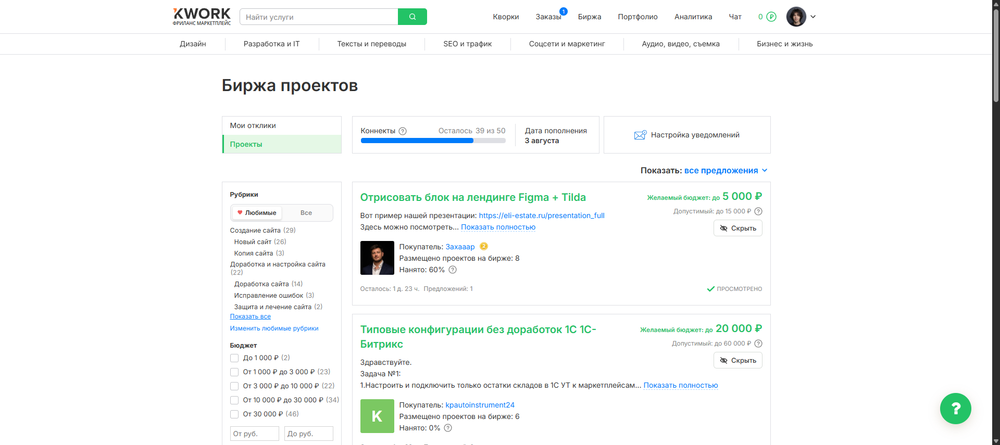

# Kwork — скрытие проектов




Chrome-расширение для биржи [kwork.ru/projects](https://kwork.ru/projects): убирает с ленты ненужные проекты по одному клику и запоминает выбор между сессиями браузера, чтобы не пересматривать одно и то же.

## Возможности

- Кнопка «Скрыть» на каждой карточке проекта.
- Скрытые проекты сохраняются локально и не возвращаются после обновления страницы или перезапуска браузера.
- Отмена последнего действия в течение шести секунд.
- Единая лента вместо пагинации: при прокрутке к концу следующая страница Kwork подгружается автоматически и добавляется ниже.
- Скрытые проекты не оставляют пустых или разреженных страниц.
- Короткий статус во время загрузки и сообщение, когда все доступные проекты показаны.

## Установка

1. Откройте в Chrome страницу `chrome://extensions`.
2. Включите «Режим разработчика» в правом верхнем углу.
3. Нажмите «Загрузить распакованное расширение».
4. Выберите папку `kwork-project-hider`.
5. Откройте или обновите `https://kwork.ru/projects`.

Попапа и страницы настроек нет. Расширение запрашивает только доступ к локальному хранилищу Chrome и странице проектов Kwork.

## Использование

Нажмите «Скрыть» внизу карточки проекта. Карточка исчезнет, а внизу окна появится действие «Отменить». Если отмену не нажать, проект останется скрытым во всех будущих сессиях этого профиля Chrome.

Для просмотра следующих проектов просто прокручивайте страницу вниз. Номера страниц больше не показываются; во время запроса виден короткий статус загрузки, а в конце — сообщение, что все доступные проекты загружены.

## Разработка и проверка

```powershell
npm test
powershell -ExecutionPolicy Bypass -File .\scripts\generate-icons.ps1
```

## Технологии

- Chrome Extension Manifest V3 (content scripts, изолированный и MAIN world)
- JavaScript (без сборщика и зависимостей)
- `chrome.storage` для локального сохранения
- Node.js `node --test` для тестов

---

**Автор:** AkashiDevelop (Никита) — веб-разработчик: сайты, Telegram-боты, автоматизация, браузерные расширения, десктоп-приложения.

[Telegram](https://t.me/akashidevelpr) · [Kwork](https://kwork.ru/user/akashidevelop) · [GitHub](https://github.com/feechkablum6)